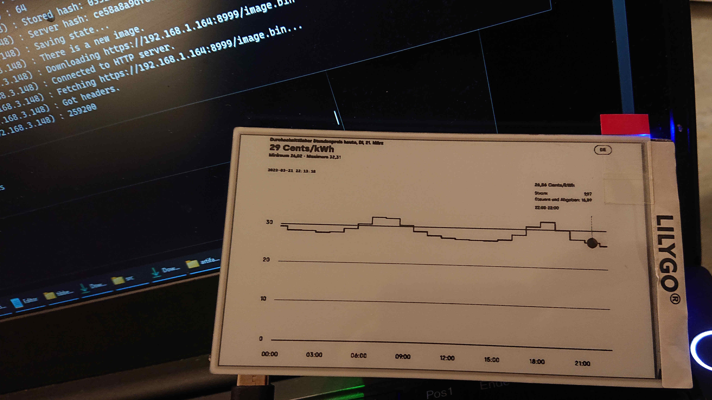
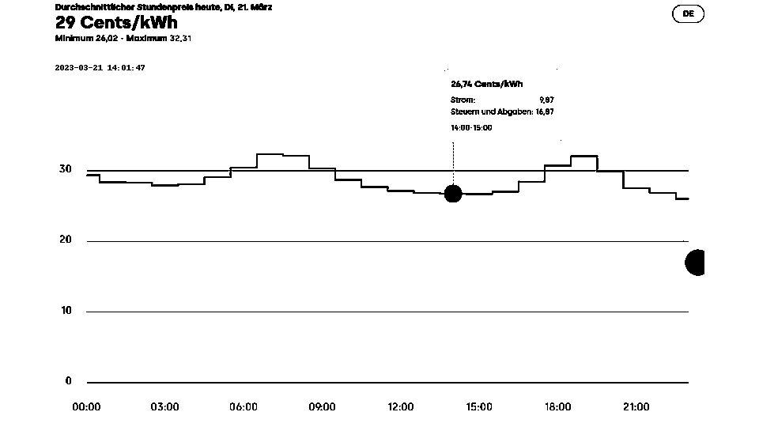
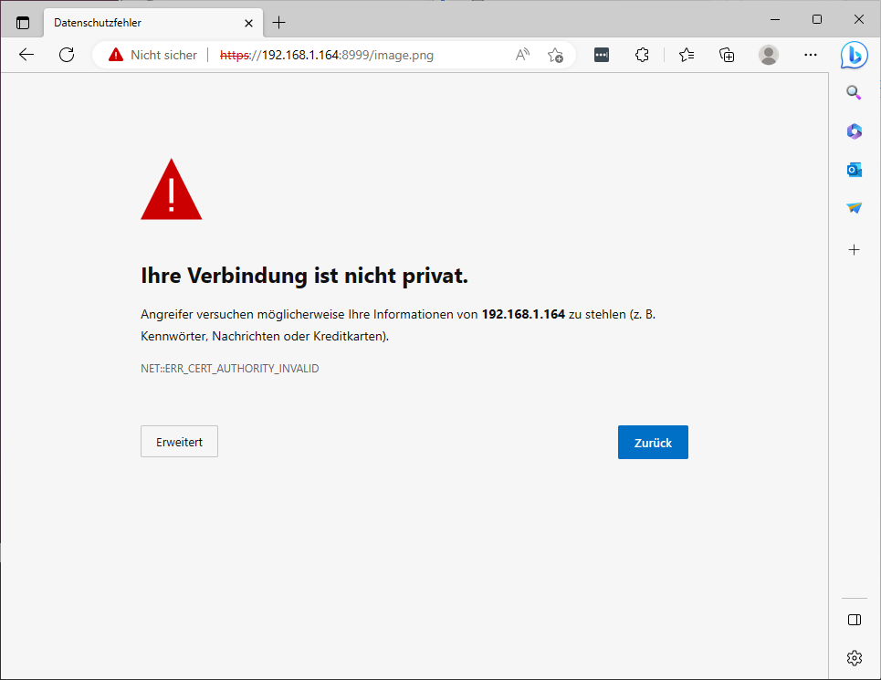
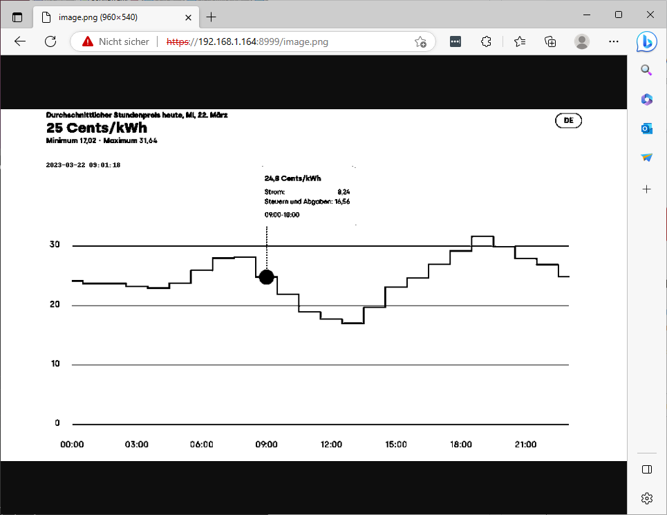

# tibberPriceChartScraper
Getting the Tibber Price Chart for Display on an ePaper.

This is a breakout from [my efforts to get ready for Smart Grid integration](https://github.com/l33tn00b/GettingReadyForSmartGrid).

.

# Just why?
You might want an ePaper display for dynamic electricity pricing in your kitchen for several reasons:

1. Real-time information: By having a display for dynamic electricity pricing in their kitchen, you can have access to real-time information about the current cost of electricity. This can help you make informed decisions about when to use energy and when to conserve.

2. Energy conservation: Seeing the current price of electricity can encourage you to conserve energy during peak periods when prices are higher. For example, you may choose to delay running the dishwasher or washing machine until off-peak hours when electricity is cheaper.

3. Cost savings: By being aware of the current price of electricity, you can take advantage of off-peak pricing and shift your energy usage to those times when electricity is cheaper. This can result in lower energy bills and cost savings over time.

4. Environmental impact: By reducing your energy usage during peak periods, you can help to reduce the strain on the grid and promote a more sustainable energy system. This can help to reduce greenhouse gas emissions and support a cleaner energy future.

To sum up, having a display for dynamic electricity pricing in your kitchen can help you make more informed decisions about your energy usage and promote energy conservation, cost savings, and environmental sustainability.

# Which provider? Tibber.
There's a limited number of providers offering dynamic electricity pricing in Germany. One of them is [_Tibber_](www.tibber.com). They offer pricing data via API for customers only. And I'm not a customer (yet). So we need to scrape the chart off their website and render it for the ePaper display. 

# How? Using an ePaper display and a container to scrape and serve the price chart.
This will be based on https://www.stavros.io/posts/making-the-timeframe/.
The resulting picture for display (having completed steps given below):
.
The picture is in landscape mode because of the chart. So the original case made by Stavros will not fit. 

I've created a container automating the scraping and serving the image of the Tibber price chart for the Timeframe to fetch.
The container is based on [Selenium-Firefox](https://github.com/SeleniumHQ/docker-selenium) and has additional modifications to automate scraping and serving the result. The web server runs on port 8999 (https) using on-the-fly generated keys. 

Why that way? Because if your tool is a hammer, every problem looks like a nail. Tool = Selenium Container. 

# Run it
## Create Container for Scraping and Serving the Chart
Steps given below are for a standard (i.e. german, serving image on port 8999) config:
- Build Container image:
  ```
  docker build . -t tibber-timeframe 
  ```
- Run the image:
  ```
  docker run -d -e "PLZ=<YOUR_ZIP_CODE_HERE> -e "TZ=Europe/Berlin" -p 8999:8999 --name ttf_server --shm-size="2g" tibber-timeframe
  ```
- Check:
  Point your browser to the server's IP at port 8999 asking for ```image.png```:
  ```
  https://<SERVER_IP>:8999/image.png
  ```
  You'll be greeted with a warning. This is perfectly normal because we're using self-signed certificates in the container:
  
  
  
  After clicking "Extended" -> "Continue to..." you'll see the chart:
  
  
  You're good to go (from the server side...).
  
## Container Customization at Startup
The container needs to be customized for your location. You will have / might want to change: 
- Zip code via ```ENV``` parameter in Dockerfile or at runtime (```-e "PLZ=<YOUR_ZIP_CODE_HERE>"```). This will affect price calculation. Each municipality has different pricing.
- Zip Code may also be specified in ```config.yml```. Default is via ```env```.
- Timezone via ```ENV``` parameter (```-e "TZ=Europe/Berlin"```) at container startup. (This is inherited from Selenium's container.)

For more configuration options (e.g. different country), see the config.yaml section below.

## Set up ePaper Display a.k.a. The Timeframe
- Stavros' instructions are based on a Linux system. This will most probably lead to issues when trying to build the firmware on Windows. I ran into a nasty error during compilation:
  ```
  .pio/libdeps/t5-4.7/WiFiManager/WiFiManager.h:172:34: fatal error: core_version.h: No such file or directory
  ```
  There's no obvious way of fixing this apart from refactoring the code to get the includes right. And I'm too lazy to do that. So:  
  - Either flash the pre-built image from his Gitlab
    - which isn't really easy 
  or
  - set up a Linux VM for compilation (which works like a charm) if:
    - you run the installer script: https://docs.platformio.org/en/latest/core/installation/methods/installer-script.html  
    - you link the pio executables to your path: https://docs.platformio.org/en/latest/core/installation/shell-commands.html
      - and manually create the directory ```~/.local/bin``` on a vanilla Ubuntu installation
    - you set the udev rules: https://docs.platformio.org/en/latest/core/installation/udev-rules.html
    - you attach both USB devices to the VM (QinHeng Electronics USB Single Serial and Unknown Device 27C6 55A4)
- You'll either have to
  - modify Stavros' source to work with the chosen port number 8999 (to be documented)
  or
  - map the container's port number 8999 to host port 443 for running the unmodified source:
    ```
    docker run -d -e "PLZ=<YOUR_ZIP_CODE_HERE> -e "TZ=Europe/Berlin" -p 443:8999 --name ttf_server --shm-size="2g" tibber-timeframe
    ```
    
## HELP!
- If you run into issues building the container image: Check your disk space. Is there any left? There's plenty of strange errors when running low.

# Alternatives 
Get raw pricing data from the European Transparency Platform, calculate pricing according to a particular provider. Render a nice chart ourselves. 

Benefits of alternative solution:
- Lightweight solution (smaller container). 
- Customizable chart. 

Drawbacks of alternative solution: 
- Requires detailed data on pricing components for each municipality. 
- Requires in-depth data on pricing calculation for each provider. 


# Issues
- Web Scraping the Chart needs a Browser (Selenium). So the server side component has to be run on a (relatively) beefy machine (so many dependencies). Can't additionally load my little Rapberry with this.
- Chart rendering isn't quite as good as intended. The tool tip indicating the current price is too small. 

# Technical Deep-Dive
## Steps to scrape the chart using Selenium:
- Load cookies (cookie banner be gone) or run browser with appropriate extension (need to install it in Selenium container).
- Add Zip Code to input field: ```driver.find_element(By.XPATH, "/html/body/div[1]/main/div[4]/div/section/div/div[1]/div/div/div[1]/div/div/section/div[2]/div/div/div[1]/div/div/span/input")```
- Click Button: ```input_button = driver.find_element(By.XPATH,"/html/body/div[1]/main/div[4]/div/section/div/div[1]/div/div/div[1]/div/div/section/div[2]/div/div/div[1]/div/div/button")```
- Find chart: ```price_chart = driver.find_element(By.XPATH,"/html/body/div[1]/main/div[4]/div/section/div/div[1]/div/div/div[1]/div/div/section/div[2]/div")``` 
- Save Screenshot: ```price_chart.screenshot("<location>")```
This will -of course- be badly broken if Tibber decide to change their website (absolute XPATHs for identification of objects).

## Building a Container doing the scraping and conversion:
- Start by using the official Selenium Chrome Container (https://github.com/SeleniumHQ/docker-selenium): ```docker run selenium/standalone-chrome python3 --version``` Does it run? Good.
- Thank you, StackOverflow (https://stackoverflow.com/questions/47955548/docker-image-with-python3-chromedriver-chrome-selenium): Create a ```Dockerfile``` adding Selenium Python Modules to the already installed Selenium:
  ```
  FROM selenium/standalone-firefox
  USER root
  RUN wget https://bootstrap.pypa.io/get-pip.py
  RUN python3 get-pip.py
  RUN python3 -m pip install selenium
  ``` 

  Then build it: 
  ```
  docker build . -t selenium-firefox-test 
  ```
  There should be an image, now:
  ```
  root@dockerRunnerTest:/home/<username># docker image list
  REPOSITORY                   TAG       IMAGE ID       CREATED         SIZE
  selenium-firefox-test        latest    dbad8bee893c   2 hours ago     1.38GB
  selenium/standalone-firefox  latest    f8f3ec83b422   8 days ago      1.3GB
  hello-world                  latest    feb5d9fea6a5   17 months ago   13.3kB
  ```
  What an irony. Using a GB-sized container for generating a kB-sized image. 
  
  Run it, directly going to a Python shell:
  ```
  docker run -it --shm-size="2g" selenium-firefox-test python3
  ```
  Test it:
  ```
  >>> from selenium import webdriver
  >>> from selenium.webdriver.common.keys import Keys
  >>> from selenium.webdriver.common.by import By
  >>> driver=webdriver.Firefox()
  ...
  ```
  
  Run it detached:
  ```
  docker run -d -e "PLZ=<YOUR_ZIP_CODE_HERE>" -e "TZ=Europe/Berlin" -p 8999:8999 --name busy_shockley --shm-size="2g" selenium-firefox-test
  ```
  Need to have VNC ? Password is "secret".
  ```
  docker run -d -e "PLZ=<YOUR_ZIP_CODE_HERE>" -e "TZ=Europe/Berlin" -p 7900:7900 -p 8999:8999 --name busy_shockley --shm-size="2g" selenium-firefox-test 
  ```
  
  
  Connect to it:
  ```
  docker exec -it busy_shockley /bin/bash
  ```
  
  Need to download files? 
  Mount a host directory into the container. Need to fix permissions first (see https://github.com/SeleniumHQ/docker-selenium last section)
  ```
  cd /home/<YOUR_USERNAME_HERE>/<YOUR_SUBDIR_HERE>
  mkdir download
  chown 1200:1201 download
  ```
  Start the container, mounting the newly created directory:
  ```
  docker run -d -e "PLZ=<YOUR_ZIP_CODE_HERE> -e "TZ=Europe/Berlin" -p 7900:7900 -p 8999:8999 --shm-size="2g" --name busy_shockley -v /home/<YOUR_USERNAME_HERE>/<YOUR_SUBDIR_HERE>/download:/home/seluser/files selenium-firefox-test
  ```
 
## Scraping: 
Selenium's containers run supervisord coordinating programs/services inside the container.
Selenium's supervisor configuration is given in ```/etc/supervisor/conf.d/selenium.conf```. We'll just add another ```.conf```file handling 
- Web Server Startup (nginx),
- Cron Startup,
- Initial scrape after container startup (further scrapes will be initiated by a cronjob starting the scrape script).
  
## Caveats
- Container Differences
  - Using Selenium-Chrome will drop you into a root shell in the container
  - Using Selenium-Firefox will drop you into a user shell in the container... 
That makes for quite a difference in behaviour. For the Firefox container, Python modules need to be installed as user seluser. 
In the Chrome container, you may install these as root. 
Do also make sure, you're running the scraping script from the user home directory or a directory that is at least user-writeable. Else the Selenium Driver for Firefox will fail miserably (complaining about missing write permission for a log file).

- Browser Differences  
  Screenshots will be different, see below. Firefox will give a better result by capturing the axes. So the script/Dockerfile is written for the Selenium-Firefox container.
  Chrome: 
  
  Firefox: 
  

- Cron:
  - cron needs to be (re-)started at container init (because there is no init system)
  - per-user crontabs are dicey. Use system-wide /etc/crontab instead.
  - Supervisor (I think) runs as non-root user in the Firefox container. So we cannot run conf-scripts demanding switching to user=root. Working around that by using sudo in the shell script.
  
- Encryption:
 Https keys generation: I'd have loved to properly do this on the fly at container startup. But generating keys takes quite a long time. So we either use shorter keys (or copy pre-made ones into the container).

- Time zone issues:
Getting the correct local time inside the Selenium container is quite a feat. Time zone is set via an env parameter. This will only be honored when in a normal shell (because the system in the cotainer still runs on UTC as set in /etc/timezone). When running our cronjob to do once-a-day scraping we'd like to add a timestamp to the image. But this is not a normal shell, it's a cronjob. So any time queries will fall back to responding in UTC. Resorted to exporting TZ Env Parameter before execution of the command. It works. Doesn't have to be beautiful.

# ToDo:
- Provide bin file for ePaper display when there hasn't been a scrape, yet.
- Done: Create crontab at startup (we need to export our env variables into the cron environment)
- No: Alternative: Source complete env before starting jobs in crontab
- Done: Add conversion scripts from "The Timeframe"
- Done: Modify Conversion Scripts to crop screenshot
- Done: Change background in selenium to white (for screenshot) (done, doesn't work, so we invert the colors using Python Imaging Library (Pillow))
- Done: Change container time to local timezone (done, see https://github.com/SeleniumHQ/docker-selenium/wiki/Setting-a-Timezone)
- Done: Add flask so we may serve the result directly from our container using Python (not, instead use proper server for https, nginx, done)
- Done: Set Zip Code via env parameter at container startup
- Done: Add timestamp to screencapture to show latest update
- Use generated/provided DH parameters (https://github.com/MarvAmBass/docker-nginx-ssl-secure/blob/master/ssl.conf)

# Things that probably never will come to pass:
- Proper certificates for https (maybe https://anuragbhatia.com/2020/05/sys-admin/automated-ssl-certificate-management-for-private-containers/)
- Give users a choice of length for DH group via env parameters (https://github.com/MarvAmBass/docker-nginx-ssl-secure).
- Proper handling of security updates (crude cron-based solution running unattended-upgrades once a day. Risk of breaking things.).
- Proper localization.

# Activating syslog
```sudo apt-get install rsyslog``` 
Go to config file to activate cron logging to syslog...

# Scrape-Script Documentation
The script for scraping contains quite some examples of bad coding practice. You have been warned. Some examples include:
- Using global variables 
- Overwriting files without asking
- Using sudo to write to directories
- Inconsistency wrt whether hashes are calculated inside a function or separately
- ...

## calc_bin_image_hash
The function takes a single argument ```bin_filename``` of type ```string```. The purpose of this function is to calculate the SHA-256 hash of a binary file and save it to a separate file with the extension .sha.

The function first imports the hashlib module, which provides various hash algorithms. Specifically, it uses the SHA-256 algorithm for hashing the file.

Next, it calculates the hash of the file contents using ```hashlib.sha256(data).hexdigest()```. The ```hexdigest()``` method returns the hash as a string of hexadecimal digits.

The function then opens a file with the name ```bin_filename``` + ".sha" in binary write mode ("wb") using a with statement. Inside the with block, it writes the content hash to the file using the write() method, which expects a bytes-like object. The ```encode()``` method is used to convert the hash string to bytes.

Finally, the function returns the content hash as a string.

## bincode_image
his is a Python function that encodes a PIL Image into a binary format suitable for display on an ePaper device. The encoded image is also written to a file specified by the outfile argument.

The function takes two arguments: im, which is a PIL Image object representing the image to be encoded, and outfile, which is a string specifying the file name for the encoded image.

The encoding process works by iterating through each pixel in the image row by row. For each pixel, the function extracts the RGB color values and uses bitwise operations to combine them into a single byte value. This byte is added to a list called contents. Once the function has processed all the pixels in a row, it writes the contents list to the output file in binary format.

After the encoding process is complete, the function calls ```calc_bin_image_hash``` to calculate a hash of the encoded image file. This hash is not used in the encoding process, but will be used for update checking purposes (i.e. is there a new image to be displayed?) later.

